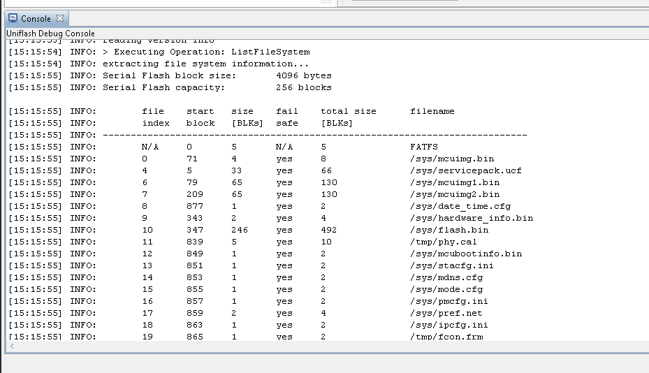
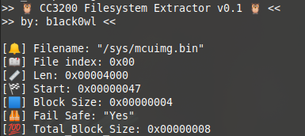
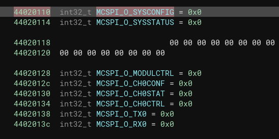
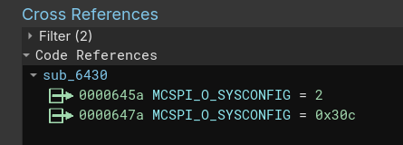
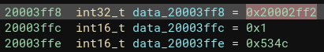

# CC3200 Filesystem Extractor v0.1
🔔 Ding-Dong. The Gen 1 Ring Doorbell (and possibly others?) utilize a CC3200 SoC which is made by Texas Instruments. The filesystem according to the datasheet is `a proprietary file system on the SFLASH.` So, to help figure how it all works a [development board](https://www.ti.com/tool/CC3200-LAUNCHXL) was personally purchased, the SPI was upgraded to 4MB, and the SDK was installed. By using `procmon` it was found that a file called `cc3xxx/bin/win/FlashAPI.dll` was being loaded by `Uniflash` when flashing the device or when the `ListFileSystem` feature was used. This library contained the logic needed to parse the filesystem. <3





## What does this script do?!
The purpose of this script is to help researchers parse the "proprietary" filesystem in order to load the running binaries into a disassembler of their choice. This extractor is very bare-bones, so YMMV.


## Memory Map

* A listing of the memory regions are defined with the SDK and each region typically has a length of `0x0FFF` which can be found in the datasheet.

```
FLASH_BASE              0x01000000
SRAM_BASE               0x20000000
WDT_BASE                0x40000000
GPIOA0_BASE             0x40004000
GPIOA1_BASE             0x40005000
GPIOA2_BASE             0x40006000
GPIOA3_BASE             0x40007000
GPIOA4_BASE             0x40024000 
UARTA0_BASE             0x4000C000
UARTA1_BASE             0x4000D000
I2CA0_BASE              0x40020000
TIMERA0_BASE            0x40030000
TIMERA1_BASE            0x40031000
TIMERA2_BASE            0x40032000
TIMERA3_BASE            0x40033000
STACKDIE_CTRL_BASE      0x400F5000
COMMON_REG_BASE         0x400F7000
FLASH_CONTROL_BASE      0x400FD000
SYSTEM_CONTROL_BASE     0x400FE000
UDMA_BASE               0x400FF000
SDHOST_BASE             0x44010000
CAMERA_BASE             0x44018000
I2S_BASE                0x4401C000
SSPI_BASE               0x44020000
GSPI_BASE               0x44021000
LSPI_BASE               0x44022000
ARCM_BASE               0x44025000
APPS_CONFIG_BASE        0x44026000
GPRCM_BASE              0x4402D000
OCP_SHARED_BASE         0x4402E000
ADC_BASE                0x4402E800
HIB1P2_BASE             0x4402F000
HIB3P3_BASE             0x4402F800
DTHE_BASE               0x44030000
SHAMD5_BASE             0x44035000
AES_BASE                0x44037000
DES_BASE                0x44039000
```

It's possible to map these regions within a disassembler in order to figure out which registers are used within these regions. For example in the screenshots below, the `SSPI_BASE` region was mapped and the `Reanalyze` feature within Binary Ninja was used to populate which registers were being used by the bootloader. From there the register names (found in the SDK) were applied.




## TODOs
* The `/sys/mcuimg*.bin` files contain a 64-bit header. The last 16 bits seem to be a constant of `0x534C`, but the first 32 bits are unknown and seem to be addr related and the middle 16-bits are currently unknown, but could be a shift value of some sort? The screenshot below is for `/sys/mcuimg.bin` which has a base address of `0x20004000` and is defined as `Hwi.vectorTableAddress` within the `app.cfg` for `TI-RTOS`. The other mcuimg files contain different values for the first 48-bits, but the last 16-bits of `0x534C` remain the same.



* The bootloader and mcuimg.bin are unencrypted in memory and can be obtained via JTAG. However trying to dump the contents of SRAM above `0x20007000` returns bytes with a very high entropy, so it's assumed that the contents of anything above that address is encrypted. There are private keys within the FS, so more research is needed to determine if those keys are used to encrypt/decrypt those memory areas.

* Once the headers for the `/sys/mcuimg*.bin` files are figured out then a loader for a disassembler can be created.


## Notes
* This script is very alpha, so problems may arise. ❤️

## Fun fact
* As of November 19th, 2023 the `SRAM` regions within the SDK currently have the following definitions:
```
RAM_BASE 0x20004000
SRAM_CODE [redacted] (RWX)
SRAM_DATA [redacted] (RWX)

SECTIONS
{
    .intvecs:   > RAM_BASE
    .init_array : > SRAM_CODE
    .vtable :   > SRAM_CODE
    .text   :   > SRAM_CODE
    .const  :   > SRAM_CODE
    .cinit  :   > SRAM_CODE
    .pinit  :   > SRAM_CODE
    .data   :   > SRAM_DATA
    .bss    :   > SRAM_DATA
    .sysmem :   > SRAM_DATA
    .stack  :   > SRAM_DATA(HIGH)
}
```
It's not certain if the Ring shares the same settings, but it seems a little suspicious to see `RWX` applied to every section in a SDK. 👀

-[@b1ack0wl](https://twitter.com/b1ack0wl)